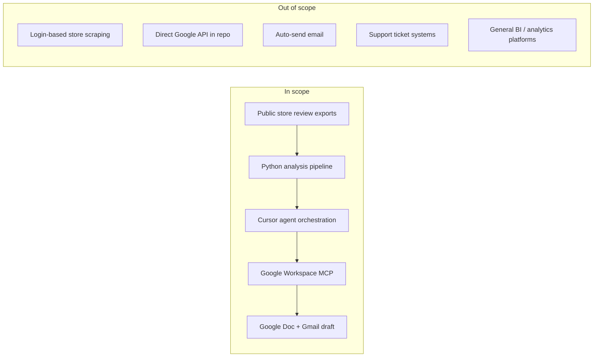
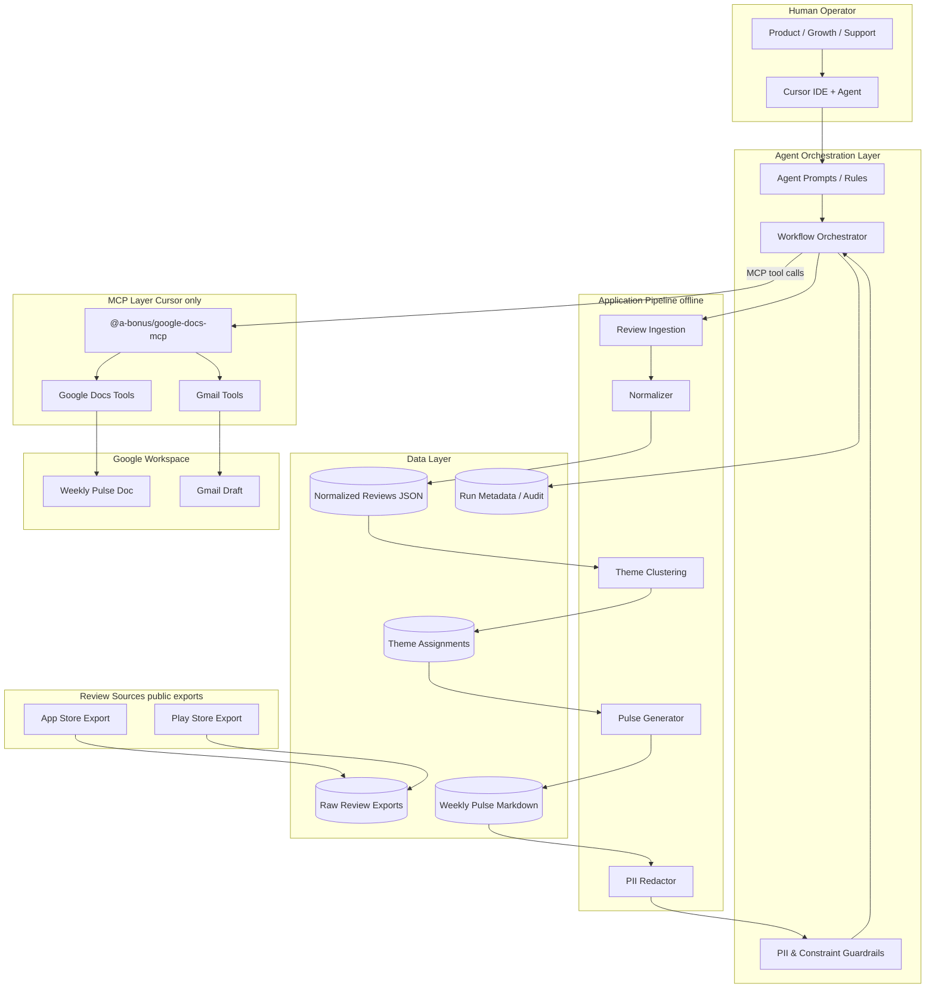
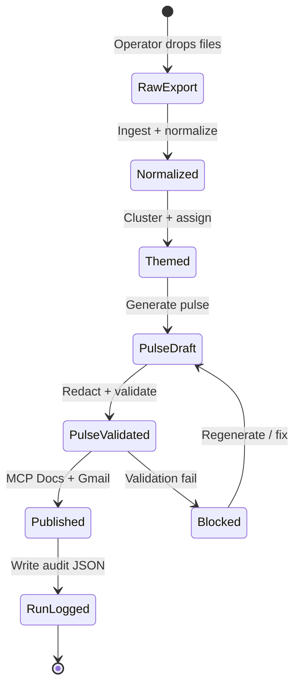
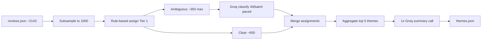
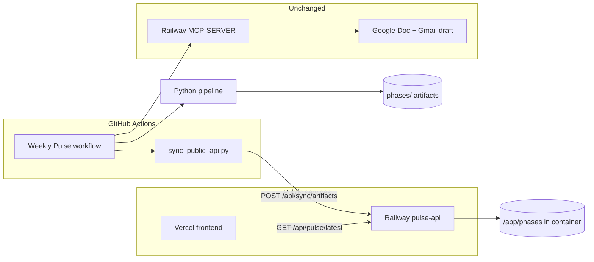

# Weekly App Review Pulse — System Architecture

**Document version:** 2.1  
**Reference:** [ProblemStatement.md](./ProblemStatement.md)  
**Product context:** **Groww App** (Milestone 1 — iOS + Android)  
**Approach:** Cursor AI agent + Python pipeline + Google Workspace MCP

---

## 1. Executive Summary

This document defines the technical architecture for a **Weekly App Review Pulse** agent. The system ingests public App Store and Play Store reviews, clusters them into themes, generates a scannable weekly note, and delivers it through **Google Docs** and a **Gmail draft** — with all Google Workspace access routed through an **MCP server in Cursor**, not application-level API code. A **read-only public API and Vercel frontend** (Phase 7) expose the latest pulse to stakeholders without local setup.

The system serves three audiences with one artifact:

| Audience | Need | How architecture supports it |
|----------|------|------------------------------|
| Product / Growth | What to fix next | Top themes ranked by volume + actionable ideas |
| Support | What users are saying | Representative quotes tied to themes |
| Leadership | Weekly health pulse | ≤ 250 words, scannable structure, no raw review dump |

Design principles:

| Principle | Implementation |
|-----------|----------------|
| Public data only | Review CSV/JSON exports; no login scraping |
| MCP-only Google | `@a-bonus/google-docs-mcp` for Docs + Gmail |
| Privacy | PII redaction before any artifact or MCP call |
| Scannable output | ≤ 250 words; top 3 themes, 3 quotes, 3 actions |
| Reproducible | Scripted pipeline + documented agent prompts |
| Agent-orchestrated | Cursor agent invokes scripts and MCP tools in sequence |
| Separation of concerns | Deterministic analysis in pipeline; integration in agent |
| Fail closed on compliance | Invalid pulse or PII blocks MCP publish |

---

## 2. System Context

### 2.1 Boundaries



### 2.2 Actors

| Actor | Role | Touchpoints |
|-------|------|-------------|
| **Operator** | Product/growth/support engineer running the weekly workflow | Places exports, triggers pipeline, approves MCP publish |
| **Cursor Agent** | Orchestrator for MCP steps and recovery | Reads artifacts, validates constraints, calls MCP tools |
| **Python Pipeline** | Offline analysis engine | Ingest → normalize → theme → pulse → guardrails |
| **MCP Server** | Google OAuth + API proxy | Docs creation, content write, Gmail draft |
| **Reviewer (leadership)** | Consumer of pulse | Reads Google Doc, forwarded email draft, or public Vercel dashboard |

### 2.3 Execution Model

The workflow is **semi-automated** with optional full automation via GitHub Actions:

1. **Batch phase (local or CI):** Operator or GitHub Actions runs the Python pipeline to produce validated artifacts on disk.
2. **Publish phase (MCP):** `src.publish.e2e_run` publishes artifacts to Google via Railway MCP HTTP server (or agent in Cursor).
3. **Public sync phase (CI):** GitHub Actions POSTs phase artifacts to Railway pulse-api (`scripts/sync_public_api.py`).
4. **Human gate:** Gmail draft is created but **not sent** — operator reviews before forwarding.

This split is intentional: analysis is testable and repeatable; Google integration stays inside MCP where OAuth and API scope are managed.

---

## 3. High-Level System Architecture



### 3.1 Component Responsibilities

| Component | Responsibility | Inputs | Outputs |
|-----------|----------------|--------|---------|
| **Cursor Agent** | End-to-end workflow coordination; MCP publish; error recovery | Validated pulse + run context | Doc URL, draft confirmation, run summary |
| **Agent Prompts / Rules** | Enforce constraints (≤5 themes, ≤250 words, no PII, MCP-only Google) | Operator intent | Step-by-step workflow the agent follows |
| **Review Ingestion** | Load 8–12 weeks of App Store + Play Store exports | Raw CSV/JSON files | Parsed rows per store |
| **Normalizer** | Unify schema; filter invalid rows; drop identity fields | Parsed rows | Normalized review records |
| **Theme Clustering** | Group reviews into ≤ 5 themes with stats and quote candidates | Normalized reviews + taxonomy | Theme assignments + rankings |
| **Pulse Generator** | Produce structured weekly note: top 3 themes, 3 quotes, 3 actions | Theme assignments | Pulse markdown + structured JSON |
| **PII Redactor** | Strip usernames, emails, phones, account IDs | Pulse text and quotes | Redacted content |
| **Constraint Validator** | Hard checks on word count, section counts, PII patterns | Pulse artifacts | Pass/fail + error detail |
| **MCP Server** | Authenticate to Google; expose Docs and Gmail tools | Agent tool calls | Google resource IDs |
| **Run Metadata** | Audit trail without sensitive content | Run stats + Google IDs | Run JSON log |

### 3.2 Trust Boundaries

```
┌──────────────────────────────────────────────────────────────┐
│  TRUST ZONE A — Local repo + operator machine                │
│  Raw exports, processed JSON, pulse markdown                 │
│  No Google credentials; no outbound Google API from Python   │
└────────────────────────────┬─────────────────────────────────┘
                             │ validated artifacts only
                             ▼
┌──────────────────────────────────────────────────────────────┐
│  TRUST ZONE B — Cursor agent session                         │
│  Reads artifacts; enforces publish gate; calls MCP only      │
└────────────────────────────┬─────────────────────────────────┘
                             │ MCP protocol (OAuth inside server)
                             ▼
┌──────────────────────────────────────────────────────────────┐
│  TRUST ZONE C — MCP server + Google Workspace                │
│  OAuth tokens; Docs/Gmail API calls; external sharing        │
└──────────────────────────────────────────────────────────────┘
```

PII must not cross from Zone A to Zone C without passing through redaction and validation. The validator is the **publish gate**: failed validation means no MCP calls.

---

## 4. Data Architecture

### 4.1 Data Lifecycle



| Stage | Mutability | Retention | PII policy |
|-------|------------|-----------|------------|
| Raw exports | Replace weekly | Local; gitignore if large | May contain PII in source — never commit |
| Normalized reviews | Immutable per run | Local processed folder | Identity fields dropped at parse |
| Theme assignments | Immutable per run | Local processed folder | IDs only; no reviewer names |
| Pulse markdown | Immutable per run | Local output folder | Fully redacted |
| Run metadata | Append-only log | Local output folder | Counts and Google IDs only |
| Google Doc / Draft | Created per run | Google Workspace | Must match validated local pulse |

### 4.2 Review Record Schema

```json
{
  "id": "sha256-of-store-date-text",
  "store": "app_store | play_store",
  "rating": 1,
  "title": "string | null",
  "text": "string",
  "review_date": "ISO-8601",
  "locale": "en-IN",
  "week_bucket": "2026-W23"
}
```

**Field rationale:**

| Field | Purpose |
|-------|---------|
| `id` | Stable deduplication when same review appears in overlapping exports |
| `store` | Enables store-level stats and quote attribution |
| `rating` | Theme severity context; action prioritization |
| `title` | App Store often has titles; Play may not — nullable |
| `text` | Primary input for theme clustering |
| `review_date` | Window filtering (8–12 weeks) |
| `locale` | Optional segmentation; useful for multi-market apps |
| `week_bucket` | ISO week for trend context in run metadata |

**Excluded fields (never persisted):** reviewer name, reviewer ID, email, device ID, account number, profile URL.

### 4.3 Theme Assignment Schema

```json
{
  "theme_id": "onboarding",
  "label": "Onboarding & first-time setup",
  "review_count": 42,
  "avg_rating": 2.1,
  "sample_review_ids": ["...", "...", "..."],
  "rank": 1
}
```

Themes are ranked by `review_count` (default). Business priority overrides can be applied via configuration when two themes are close in volume.

### 4.4 Weekly Pulse Schema

```json
{
  "product": "<product-name>",
  "week_ending": "2026-06-08",
  "review_window_weeks": 10,
  "total_reviews": 312,
  "store_breakdown": { "app_store": 145, "play_store": 167 },
  "top_themes": [
    { "rank": 1, "theme_id": "kyc", "label": "KYC verification", "summary": "..." }
  ],
  "quotes": [
    { "theme_id": "kyc", "text": "Redacted quote", "rating": 2, "store": "play_store" }
  ],
  "action_ideas": [
    { "theme_id": "kyc", "action": "Add in-app KYC status tracker", "rationale": "..." }
  ],
  "word_count": 218,
  "markdown": "# Weekly Pulse\n..."
}
```

The structured JSON sidecar enables validation without parsing markdown and supports future automation (e.g., dashboards) without changing the pulse format.

### 4.5 Directory Layout

```
LIP-4-4/
├── Docs/
│   ├── ProblemStatement.md
│   ├── architecture.md
│   ├── phase-wise-implementationplan.md
│   ├── decision.md
│   ├── review-export-formats.md
│   └── phases/
│       └── phase-N/
│           ├── eval.md
│           └── deliverables.md
├── config/
│   ├── product.yaml            # Groww product + review window
│   └── themes.yaml             # Theme taxonomy + keywords
├── data/
│   └── raw/                    # Shared inputs — store CSV exports only
├── phases/                     # Phase deliverables (one folder per phase)
│   ├── phase-0/                # reports, fetch_metadata, storage_validation
│   ├── phase-1/                # reviews.json
│   ├── phase-2/                # themes.json
│   ├── phase-3/                # pulse.md, pulse.json
│   ├── phase-4/                # doc_metadata.json
│   ├── phase-5/                # run.json
│   └── phase-6/                # signoff_report.json
├── src/
│   ├── ingest/                 # Phase 1
│   ├── themes/                 # Phase 2 (rules + Groq client)
│   ├── pulse/                  # Phase 3
│   ├── guardrails/             # Phase 3
│   ├── publish/                # Phases 4–5 (Railway MCP HTTP client)
│   └── api/                    # Phase 7 (FastAPI read + sync)
├── frontend/                   # Phase 7 (Next.js dashboard)
├── scripts/
│   ├── sync_public_api.py      # Push phases/ to Railway pulse-api
│   └── phase6_signoff.py
├── Dockerfile                  # Railway pulse-api image
├── railway.toml
├── prompts/
│   ├── weekly-pulse-agent.md
│   ├── publish-doc.md
│   ├── draft-email.md
│   └── groq-theme-classify.md  # Groq batch classification prompt
├── tests/
│   └── fixtures/
└── README.md
```

**Configuration vs code:** Theme taxonomy, review window default, email alias, and product name live in config/README — not hardcoded in analysis logic.

---

## 5. Pipeline Architecture (Offline Analysis)

### 5.1 Stage Overview

```mermaid
flowchart LR
    A[Raw exports] --> B[Parse per store]
    B --> C[Normalize + dedupe]
    C --> D[Filter 8–12 week window]
    D --> E[Rule-based theme assign]
    E --> F[Aggregate ≤ 5 themes]
    F --> G[Select top 3 + quotes]
    G --> H[Generate pulse]
    H --> I[Redact PII]
    I --> J[Validate constraints]
    J --> K[Write artifacts]
```



### 5.2 Ingestion Layer

**Purpose:** Convert heterogeneous store exports into one canonical review model.

| Concern | Approach |
|---------|----------|
| Format drift | Per-store parsers; documented column mapping |
| Missing fields | Skip row with logged warning; do not fail entire run for single bad row |
| Duplicates | Hash-based `id` from store + date + text |
| Date ambiguity | Normalize to ISO-8601; store original only if needed for debug |
| Window enforcement | Configurable `weeks` param (8–12 inclusive) |

### 5.3 Theme Clustering Layer

**Purpose:** Turn unstructured review text into ranked, countable themes.

**Hybrid strategy** (see [decision.md](./decision.md) ADR-010, ADR-021):

0. **Subsample (Tier 0):** Cap Phase 2 input at **1,000 reviews** from `phases/phase-1/reviews.json` (~2,143 available). Stratified sample by rating; deterministic seed for reproducibility. Full ingest artifact is unchanged — subsampling happens only in the theme pipeline.
1. **Primary (Tier 1):** Rule/keyword matching against `config/themes.yaml` — fast, deterministic, testable. CI and golden tests use this path only (fixtures ≤ 50 reviews; no Groq).
2. **Groq-assisted (Tier 2):** For reviews with **no keyword match** or **multi-theme tie**, batch-classify via **Groq** — ambiguous subset only, after taxonomy expansion.
3. **Groq summaries (Tier 3):** **One** Groq call per run: theme stats + 10 sample reviews per top theme → one-line leadership summaries in `themes.json`.

**LLM provider:** [Groq](https://groq.com/) — model **`llama-3.3-70b-versatile`**, `GROQ_API_KEY` in environment only (see ADR-021). Phase 3 pulse text stays **template-first** (no Groq by default) to preserve daily token headroom.

**Groq free-tier limits (must not exceed per weekly run):**

| Limit | Quota | Phase 2 budget (1,000 reviews) |
|-------|------:|----------------------------------|
| Requests / minute | 30 | **≤ 10 requests** (paced) |
| Requests / day | 1,000 | **~10 requests** (~1% of quota) |
| Tokens / minute | 12,000 | **≤ 9,000 peak minute** (3 batched calls max, then pause) |
| Tokens / day | 100,000 | **~25,000–32,000** (~25–32% of quota) |

**Per-run call plan (1,000 reviews, after taxonomy expansion):**

| Step | Groq calls | Est. tokens/call | Est. total |
|------|----------:|-----------------:|-----------:|
| Batch classify (ambiguous ~250–350 reviews, **40/call**) | 7–9 | ~2,800 | ~22,000–25,000 |
| Theme summaries (top 5 themes, 10 samples each) | 1 | ~3,500 | ~3,500 |
| **Total per weekly run** | **8–10** | — | **~25,000–32,000** |

**Rate limiter (required in `groq_client.py`):** max **3 classify requests per rolling minute** (~9K tokens); **≥ 21 s** between consecutive requests; on `429` / rate-limit response, exponential backoff and retry once. Never parallelize Groq calls.

**Data-driven routing** (from Phase 1 profile — scaled to 1,000-review sample):

| Review bucket | ~Share | Handler |
|---------------|-------:|---------|
| Single clear keyword match | ~29% | Rules only — **no Groq** |
| No keyword match | ~63% → **~25% after taxonomy fix** | Taxonomy expansion first, then Groq batch |
| Multi-theme match | ~9% | Groq tie-break (same batches) |

**Do not** send all 1,000 reviews to Groq (~30K tokens input alone). Rules handle ~700+ clearly or via fallback; Groq handles **~250–350 ambiguous** reviews only.

**Aggregation rules:**

- Assign every review to exactly one theme (including fallback theme for unmatched).
- Count reviews per theme; compute average rating.
- Keep at most **5 themes** in the analysis output (merge or drop tail themes per policy).
- Surface **top 3** in the pulse by volume.

**Quote selection:** Pick short, representative quotes per top theme — prefer reviews that clearly illustrate the theme and are suitable for leadership reading (after redaction).

### 5.4 Pulse Generation Layer

**Purpose:** Produce a one-page narrative from theme statistics.

**Pulse structure (logical sections):**

1. **Header** — Product name, week ending, review window, total review count
2. **Top 3 themes** — One-line summary each with count and avg rating
3. **3 user quotes** — Anonymized; one per theme where possible
4. **3 action ideas** — Specific, tied to themes; include brief rationale

**Tone:** Factual, concise, no jargon. Actions should be doable (e.g., "Add in-app KYC status tracker") not vague ("Improve UX").

### 5.5 Guardrails Layer

**Purpose:** Enforce ProblemStatement constraints before any external publish.

| Check | Type | On failure |
|-------|------|------------|
| Word count ≤ 250 | Hard | Block publish; regenerate or truncate |
| Exactly 3 themes in pulse | Hard | Block publish |
| Exactly 3 quotes | Hard | Block publish |
| Exactly 3 actions | Hard | Block publish |
| ≤ 5 themes in clustering output | Hard | Merge or abort per config |
| PII patterns absent | Hard | Block publish; re-run redactor |
| Review window 8–12 weeks | Hard | Abort ingestion |

The agent must treat validator failure as a **stop signal** — no MCP calls until resolved.

---

## 6. Agent Workflow Architecture

The agent is the **integration layer**. Application code produces artifacts; the agent publishes via MCP.

```mermaid
sequenceDiagram
    participant U as Operator
    participant A as Cursor Agent
    participant P as Python Pipeline
    participant V as Validator
    participant M as Google MCP Server
    participant G as Google Workspace

    U->>A: Run weekly pulse workflow
    A->>P: Run ingest → themes → pulse
    P-->>A: Artifacts on disk
    A->>V: Validate pulse + PII
    alt validation fails
        V-->>A: Errors
        A-->>U: Report failures; no MCP
    else validation passes
        V-->>A: OK
        A->>M: createDocument(title)
        M->>G: Google Docs API
        G-->>M: documentId
        A->>M: write pulse to doc
        M->>G: Update document
        A->>M: createDraft(to, subject, body)
        M->>G: Gmail API
        G-->>M: draftId
        A->>A: Write run metadata
        A-->>U: Doc link + draft confirmation + run summary
    end
```

### 6.1 Agent Responsibilities vs Pipeline Responsibilities

| Task | Owner | Why |
|------|-------|-----|
| Parse review exports | **Pipeline** | Deterministic, testable |
| Theme clustering | **Pipeline** (rules + Groq for ambiguous subset) | Repeatable; golden tests use rules-only |
| Pulse text generation | **Pipeline** (template-first; Groq optional for actions) | CI-friendly; consistent output |
| PII redaction | **Pipeline** | Must run before artifacts exist |
| Constraint validation | **Pipeline** + **Agent** | Script enforces hard limits; agent refuses MCP on fail |
| Google Doc creation | **Agent via MCP** | No Google SDK in repo |
| Gmail draft creation | **Agent via MCP** | No Google SDK in repo |
| Run metadata completion | **Agent** | Captures Google IDs after MCP success |
| OAuth recovery | **Agent + operator** | Re-auth via MCP when tokens expire |

### 6.2 Agent Prompt Architecture

Three prompt layers work together:

| Prompt | When used | Purpose |
|--------|-----------|---------|
| `weekly-pulse-agent.md` | Full weekly run | End-to-end orchestration from exports to draft |
| `publish-doc.md` | Docs-only or retry | MCP steps for Google Doc |
| `draft-email.md` | Gmail-only or retry | MCP steps for Gmail draft |

Agent rules (Cursor rules or inline in prompts) should restate non-negotiables: no direct Google API code, no publish on validation failure, no PII in MCP payloads.

### 6.3 Idempotency and Re-runs

| Scenario | Expected behavior |
|----------|-------------------|
| Re-run same week | Create new doc/draft OR documented update policy — must not silently overwrite without operator awareness |
| MCP fails after doc created | Run metadata partial; operator retries Gmail step only |
| Pipeline fails mid-way | No MCP calls; fix data and re-run from failed stage |
| OAuth expired | Agent surfaces MCP auth error; operator re-authenticates |

---

## 7. MCP Integration Architecture

### 7.1 MCP Server

| Setting | Value |
|---------|-------|
| Package | `@a-bonus/google-docs-mcp` |
| Transport | `npx -y @a-bonus/google-docs-mcp` via Cursor `mcp.json` |
| Auth | OAuth handled by MCP server; credentials not in repo |
| Required APIs (Google Cloud) | Docs, Drive, Gmail |

### 7.2 Tools Used in This Project

| Step | MCP tool(s) | Purpose |
|------|-------------|---------|
| Create weekly doc | `createDocument` | New Google Doc for the pulse |
| Write content | Document write/update tools exposed by server | Insert formatted pulse |
| Draft email | `createDraft` | Draft to self/alias with subject + body |
| Verify delivery | `listDrafts`, `getDraft` | Confirm draft exists with correct subject |

Exact tool names may vary by MCP server version — agent prompts should describe **intent** (create doc, write body, create draft) and discover tools from the MCP schema at runtime.

### 7.3 MCP Boundary Rules

```
┌─────────────────────────────────────┐
│  Application repo (Python)          │
│  - ingest, themes, pulse, PII       │
│  - NO googleapis imports            │
│  - NO OAuth tokens                  │
└─────────────────┬───────────────────┘
                  │ pulse.md + metadata
                  ▼
┌─────────────────────────────────────┐
│  Cursor Agent                       │
│  - reads artifacts                  │
│  - calls MCP tools only             │
└─────────────────┬───────────────────┘
                  │ MCP protocol
                  ▼
┌─────────────────────────────────────┐
│  @a-bonus/google-docs-mcp           │
│  - OAuth, Google API calls          │
└─────────────────────────────────────┘
```

### 7.4 Publish Conventions

| Artifact | Convention |
|----------|------------|
| Google Doc title | `<Product Name> Weekly Pulse — YYYY-MM-DD` |
| Gmail subject | `Weekly App Review Pulse — <Product Name> — YYYY-MM-DD` |
| Gmail recipient | Operator's email or documented alias (never external list) |
| Email body | Full pulse text or summary + link to Google Doc (document in README) |

---

## 8. Theme Taxonomy

Starter theme template in `config/themes.yaml` — **customize once the target product is chosen** (≤ 8 candidates; ≤ 5 active per run):

| Theme ID | Label | Example signals |
|----------|-------|-----------------|
| `onboarding` | Onboarding & registration | first time, sign up, register |
| `kyc` | KYC & verification | KYC, verification, documents |
| `payments` | Payments & billing | payment failed, UPI, checkout, billing |
| `statements` | Statements & reports | statement, invoice, download, receipt |
| `withdrawals` | Refunds & payouts | refund, withdrawal, payout, cancel |
| `login` | Login & OTP | OTP, login, password, biometric |
| `discovery` | Search & discovery | search, browse, explore, catalog |
| `performance` | App performance & bugs | crash, slow, freeze, bug |

**Customization process:** After product lock (Phase 0), refine keywords and labels to match domain language (e.g., SIP, folio, mandate for fintech). Add a fallback theme for unmatched reviews rather than leaving them unassigned.

The clustering step selects the **top 5 by volume** (or business priority) for the weekly analysis; the pulse surfaces the **top 3**.

---

## 9. Guardrails & Compliance

### 9.1 PII Redaction (pre-output)

| Pattern | Action |
|---------|--------|
| Email addresses | Replace with `[email redacted]` |
| Phone numbers (IN) | Replace with `[phone redacted]` |
| PAN / Aadhaar-like tokens | Replace with `[id redacted]` |
| @handles / display names | Strip or genericize |
| Account / folio numbers | Replace with `[account redacted]` |

Redaction runs on **quotes and full pulse text** after generation and before writing output files.

### 9.2 Output Constraints (hard checks)

| Constraint | Check |
|------------|-------|
| Max themes (clustering) | `len(themes) <= 5` |
| Pulse themes | Exactly 3 in output |
| Quotes | Exactly 3, each tied to a theme |
| Action ideas | Exactly 3 |
| Word count | `word_count <= 250` |
| Review window | 8–12 weeks inclusive |

### 9.3 Google Integration Constraint

Recommended CI check: fail if repo contains `googleapiclient`, `google.oauth2`, or `googleapis.com` in `src/`.

### 9.4 Compliance Posture Summary

| Requirement | Mechanism |
|-------------|-----------|
| No PII in artifacts | Drop at ingest; redact at output; validate before MCP |
| Public data only | Export files only; no scrapers |
| MCP-only Google | Architectural boundary + grep check |
| Human sends email | Draft only; never auto-send |

---

## 10. Observability & Run Audit

Each weekly run produces `phases/phase-5/run.json` (and Phase 4 may write `phases/phase-4/doc_metadata.json`):

```json
{
  "run_id": "2026-06-09T10:00:00Z",
  "product": "<product-name>",
  "review_window": { "start": "2026-03-15", "end": "2026-06-08", "weeks": 12 },
  "stores": { "app_store": 145, "play_store": 167 },
  "themes_used": ["kyc", "payments", "login", "statements", "onboarding"],
  "pulse_word_count": 231,
  "validation_passed": true,
  "google_doc_id": "1abc...",
  "gmail_draft_id": "r123...",
  "pii_violations_blocked": 0
}
```

No review text or PII in run logs — IDs and counts only. This supports weekly audit ("did we publish?", "how many reviews?", "which themes dominated?") without storing user content in logs.

---

## 11. Failure Modes & Recovery

| Failure | Detection | Recovery |
|---------|-----------|----------|
| Missing export file | Ingestion validator | Abort with clear path hint; operator adds file |
| Wrong export format | Parser error | Update format doc; fix parser |
| < 8 weeks of data | Date range check | Warn or abort per config |
| Single store missing | Store count check | Warn; continue or abort per config |
| > 5 themes requested | Clustering cap | Merge smallest into fallback or abort |
| Pulse > 250 words | Word count validator | Truncate/regenerate |
| PII detected in output | Regex scan | Block MCP; re-run redactor |
| Sparse reviews (< 50) | Stats threshold | Still generate; note low confidence in pulse header |
| MCP OAuth expired | Tool error from server | Re-auth via MCP; retry publish steps |
| MCP unavailable | Tool timeout | Save pulse locally; manual MCP retry via publish prompts |
| Partial publish (doc ok, draft fail) | Run metadata incomplete | Retry `draft-email.md` only; update run JSON |

---

## 12. Security Model

| Asset | Location | Notes |
|-------|----------|-------|
| Review exports | `data/raw/` (local) | Public data; gitignore if large |
| Google OAuth tokens | MCP server only | Never commit |
| `GOOGLE_CLIENT_ID/SECRET` | `~/.cursor/mcp.json` env | Not in repo |
| Normalized reviews | `phases/phase-1/reviews.json` | PII-stripped |
| Theme assignments | `phases/phase-2/themes.json` | IDs only; no reviewer names |
| Pulse output | `phases/phase-3/` | Redacted before MCP |
| Run metadata | `phases/phase-4/`, `phases/phase-5/` | Counts and Google IDs only |
| Agent transcripts | Cursor local | May contain doc IDs; treat as internal |

---

## 13. Non-Functional Requirements

| NFR | Target |
|-----|--------|
| Pipeline runtime | Full ingest + theme + pulse < 5 min on ~500 reviews (local) |
| Testability | Phases 1–3 fully unit-testable without MCP |
| Reproducibility | Teammate completes setup + one run from README in ≤ 2 hours |
| Maintainability | Store parsers isolated; theme taxonomy in YAML; Groq prompts in `prompts/` |
| Portability | Python 3.10+; Groq API for Phase 2 LLM; no cloud dependency for rules-only path |

---

## 14. Phase-to-Component Map

| Phase | Primary components built |
|-------|--------------------------|
| 0 | Docs, MCP config, theme taxonomy, repo scaffold |
| 1 | Ingestion, normalizer, raw → clean JSON |
| 2 | Theme clustering (rules + Groq), theme stats, summaries |
| 3 | Pulse generator, PII redactor, validators |
| 4 | Agent + MCP Google Docs flow |
| 5 | Agent + MCP Gmail draft + E2E orchestration |
| 6 | Golden tests, README, success-criteria validation, GitHub Actions |
| 7 | FastAPI read API, Next.js frontend, Railway + Vercel deploy, artifact sync |

See [phase-wise-implementationplan.md](./phase-wise-implementationplan.md) for phase activities and [phases/](./phases/) for per-phase eval criteria.

---

## 15. Future Extension Points (not in MVP)

| Extension | Notes |
|-----------|-------|
| Week-over-week theme delta | Compare current `themes.json` to prior run |
| Slack/Teams notification | Still avoid Google SDK; use separate MCP or webhook |
| Multi-product support | Parameterize product name and export paths |
| Automated export fetch | Only via official APIs/exports — not scraping |
| Run pipeline from UI | Trigger GitHub Actions workflow from frontend (F3) |

---

## 16. Groq LLM Integration (Phase 2)

Phase 2 uses **Groq** as the LLM provider for theme work. Google Workspace remains MCP-only; Groq is separate and used only in the offline Python pipeline.

### 16.1 Configuration

| Setting | Value |
|---------|-------|
| Provider | Groq (`https://api.groq.com`) |
| API key | `GROQ_API_KEY` in environment — never in repo |
| Model | **`llama-3.3-70b-versatile`** (fixed for Phase 2) |
| Max reviews per run | **1,000** (subsample from Phase 1 output; configurable in `config/product.yaml`) |
| Batch size (classify) | **40 reviews** per request (~2,800 tokens — fits 3 calls/min under 12K TPM) |
| Client | `src/themes/groq_client.py` (includes rate limiter + usage logging) |
| Prompts | `prompts/groq-theme-classify.md`, `prompts/groq-theme-summary.md` |

### 16.2 Groq account limits (hard constraints)

These are the **free-tier limits** for `llama-3.3-70b-versatile`. Phase 2 design must stay well inside them for a single weekly run and leave headroom for one retry pass.

| Limit | Quota | Safe Phase 2 target |
|-------|------:|--------------------:|
| Requests / minute | 30 | ≤ 10 (paced; max 3 back-to-back classify calls) |
| Requests / day | 1,000 | ~10 per weekly run |
| Tokens / minute | 12,000 | ≤ 9,000 in any rolling minute |
| Tokens / day | 100,000 | ~25,000–32,000 per weekly run (~32% max) |

**Operational rules:**

1. **Subsample to 1,000 reviews** before any Groq call — reduces ambiguous volume and keeps daily token use under ~32K.
2. **Expand taxonomy first** — target ambiguous share **≤ 35%** (~350 reviews) so classify step needs **≤ 9 batches**.
3. **Never send the full sample to Groq for classification** — rules assign ~65%+ without API calls.
4. **Exactly one summary call** per run — do not split summaries across themes into separate requests.
5. **No Groq in Phase 3 by default** — pulse is template-generated; saves ~5K+ tokens/day for re-runs.
6. **Log usage in `themes.json`** — `groq_usage: { requests, tokens_estimated }` for operator verification.

### 16.3 Pipeline flow (rate-limit aware)



| Step | Groq? | Requests | Est. tokens |
|------|-------|----------|------------:|
| Subsample 1,000 (stratified by rating) | No | 0 | 0 |
| Rule assign all 1,000 | No | 0 | 0 |
| Classify ambiguous (~250–350 reviews, 40/batch) | Yes | 7–9 | ~22,000–25,000 |
| Summarize top 5 themes (10 samples each) | Yes | 1 | ~3,500 |
| **Weekly run total** | — | **8–10** | **~25,000–32,000** |

**Pacing schedule (example for 9 classify batches + 1 summary):**

| Minute | Action | Cumulative tokens (est.) |
|--------|--------|-------------------------:|
| 0:00 | Classify batch 1–3 | ~8,400 |
| 0:21 | Classify batch 4–6 | ~16,800 |
| 0:42 | Classify batch 7–9 | ~25,200 |
| 1:03 | Summary call | ~28,700 |

Total wall time ~**1–2 minutes** of Groq calls; well under RPM and TPM caps.

### 16.4 Subsample policy (1,000 reviews)

| Rule | Detail |
|------|--------|
| Source | `phases/phase-1/reviews.json` (full window preserved in Phase 1) |
| Cap | `max_reviews: 1000` in config |
| Method | Stratified random sample by `rating` (preserve 1★–5★ proportions) |
| Tie-break | Prefer more recent `review_date` within each rating stratum |
| Seed | Fixed seed in config for reproducible weekly diffs |
| Output | In-memory list for Phase 2; record `sampled_from: 2143, sample_size: 1000` in `themes.json` stats |

Rules and aggregation run on the **1,000-review sample only**. Phase 1 artifact remains the full filtered corpus for future re-runs with a higher cap when limits allow.

### 16.5 Fail-safe behavior

| Condition | Behavior |
|-----------|----------|
| `GROQ_API_KEY` missing | Rules-only path; warnings in `themes.json` |
| Groq API error | Retry batch once after backoff; fall back to rule assignment for failed batch |
| HTTP 429 / rate limit | Pause ≥ 60 s; retry once; then rules-only for remaining batches |
| Projected tokens > 80K/day | Abort Groq; complete run rules-only; warn operator |
| CI / pytest | **Never call Groq** — fixtures ≤ 50 reviews; rules-only |
| Non-deterministic output | Store Groq summaries in artifact; tests assert structure, not prose |

---

## 17. Public Deployment Architecture (Phase 7)

Phase 7 adds a **read-only consumption layer** on top of existing phase artifacts. It does not change ingestion, pulse generation, or MCP publish logic.

### 17.1 Topology



| Service | Platform | Role |
|---------|----------|------|
| **pulse-api** | Railway (this repo) | FastAPI; serves latest pulse from synced artifacts |
| **frontend** | Vercel (`frontend/`) | Next.js dashboard + pulse page |
| **MCP-SERVER** | Railway (separate repo) | Google Doc + Gmail draft only |

**Live URLs (Groww):**

- Frontend: [weekly-pulse-grow.vercel.app](https://weekly-pulse-grow.vercel.app)
- API: [weeklypulsegrow-production.up.railway.app](https://weeklypulsegrow-production.up.railway.app)

### 17.2 API surface

| Endpoint | Auth | Purpose |
|----------|------|---------|
| `GET /api/health` | None | Liveness + artifact flags |
| `GET /api/status` | None | Pipeline snapshot for dashboard |
| `GET /api/pulse/latest` | None | Full validated pulse JSON + markdown |
| `GET /api/themes/latest` | None | Latest themes artifact |
| `POST /api/sync/artifacts` | Bearer `SYNC_SECRET` | Write phase artifacts to disk |

Application code reads the same deliverable paths as the offline pipeline (`config/product.yaml` → `phases/phase-N/`).

### 17.3 Artifact sync (no persistent volume)

Railway hobby plans often lack persistent volumes. Instead:

1. GitHub Actions runs the full weekly pipeline.
2. `scripts/sync_public_api.py` POSTs `pulse_json`, `pulse_md`, `reviews`, `themes`, and publish metadata to pulse-api.
3. pulse-api writes files under `/app/phases/` in the container filesystem.

**Operational note:** A Railway **redeploy clears synced data**. Recovery: re-run sync locally, trigger Weekly Pulse workflow, or wait for the next scheduled Monday run.

Secrets: `SYNC_SECRET` (Railway + GitHub, must match), `PUBLIC_PULSE_API_URL` (GitHub), `CORS_ORIGINS` (Railway — Vercel URL), `NEXT_PUBLIC_API_URL` (Vercel).

Deploy guide: [public-deployment.md](./public-deployment.md).

### 17.4 Trust boundary

Public endpoints expose **already-validated, redacted pulse content** only. Sync is write-protected by `SYNC_SECRET`. No Google credentials, raw exports, or MCP tools are exposed on pulse-api.

---

## 18. References

- [ProblemStatement.md](./ProblemStatement.md)
- [phase-wise-implementationplan.md](./phase-wise-implementationplan.md)
- [public-deployment.md](./public-deployment.md)
- [decision.md](./decision.md)
- MCP server: [@a-bonus/google-docs-mcp](https://www.npmjs.com/package/@a-bonus/google-docs-mcp)
