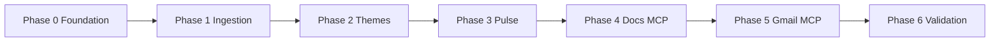

# Weekly App Review Pulse — Phase-Wise Implementation Plan

**Document version:** 2.0  
**Reference:** [ProblemStatement.md](./ProblemStatement.md) · [architecture.md](./architecture.md)  
**Evaluation:** Each phase has an `eval.md` with tests and exit criteria under [phases/](./phases/)

---

## Overview

This plan breaks the Weekly App Review Pulse into seven sequential phases. Each phase produces verifiable outcomes before the next begins. Phases 0–3 build the **offline analysis pipeline**; Phases 4–5 add **MCP-based publishing**; Phase 6 proves **success criteria and reproducibility**.

| Phase | Name | Duration (est.) | Depends on | Primary outcome |
|-------|------|-----------------|------------|-----------------|
| 0 | Foundation & Planning | 1–2 days | — | Scope locked, MCP working, repo ready |
| 1 | Review Ingestion | 2–3 days | Phase 0 | Unified, PII-safe review dataset |
| 2 | Theme Clustering | 2–3 days | Phase 1 | Ranked themes with quote candidates |
| 3 | Pulse Generation & Guardrails | 2–3 days | Phase 2 | Validated weekly pulse artifact |
| 4 | Google Docs via MCP | 1–2 days | Phase 3 | Pulse published to Google Doc |
| 5 | Gmail Draft & E2E Orchestration | 1–2 days | Phase 4 | Draft email + full workflow |
| 6 | Validation & Hardening | 2–3 days | Phase 5 | Teammate-ready, criteria met |

**Total:** ~2–3 weeks for a single developer. Phases 4–5 require MCP OAuth to be working (established in Phase 0).

**Governance rule:** Do not start the next phase until the current phase passes **all** exit criteria in its `eval.md`.

---

## Cross-Phase Principles

These apply throughout the build:

| Principle | What it means in practice |
|-----------|---------------------------|
| **Public exports only** | Never build login scrapers or paywalled API integrations |
| **MCP-only Google** | Docs and Gmail happen only through Cursor MCP tools — not in application code |
| **PII never persists** | Drop identity at ingestion; redact before output; validate before publish |
| **Fail closed** | Invalid pulse blocks MCP — fix locally first |
| **Artifact handoff** | Each stage writes clear outputs the next stage (or agent) consumes |
| **Document decisions** | Any scope or architecture change goes in [decision.md](./decision.md) |

---

## Phase 0 — Foundation & Planning

**Eval:** [phases/phase-0/eval.md](./phases/phase-0/eval.md)

### Purpose

Establish everything needed before writing pipeline logic: product scope, integration path, taxonomy, repository structure, and team alignment on constraints.

### Why this phase matters

Downstream phases assume a locked product, working MCP OAuth, and a shared theme vocabulary. Skipping Phase 0 leads to rework when export formats, theme labels, or Google setup do not match the Problem Statement.

### Key activities

#### 0.1 — Product and scope lock

- Confirm the **same Milestone 1 mobile app** (iOS + Android) as the review target.
- Record product name, store listing context, and any domain-specific vocabulary (e.g., KYC, SIP, folio) that will inform theme labels.
- Align with stakeholders on **who receives the pulse** (self, alias, distribution list for manual forward only).
- Document review export sources: how the team obtains App Store Connect and Play Console exports today.

#### 0.2 — Constraint alignment

- Walk through Problem Statement constraints with the team: ≤ 5 themes, ≤ 250 words, 3/3/3 pulse structure, no PII, MCP-only Google.
- Agree that Gmail output is a **draft only** — no auto-send.
- Define default review window (e.g., 10 weeks) within the 8–12 week allowed range.

#### 0.3 — MCP setup and smoke test

- Enable Google Docs, Drive, and Gmail APIs in Google Cloud Console; create OAuth desktop client.
- Configure `@a-bonus/google-docs-mcp` in Cursor MCP settings with client ID/secret in environment (not repo).
- Complete OAuth on first tool use.
- Verify agent can see Docs tools (create document) and Gmail tools (create draft, list drafts).
- Record any cohort-specific MCP server choice in [decision.md](./decision.md).

#### 0.4 — Theme taxonomy design

- Draft initial theme list (≤ 8 candidates) tailored to the product domain.
- For each theme: human-readable label, ID, and example keywords/phrases from real review language.
- Identify fallback behavior for reviews that match no keyword (e.g., performance or discovery bucket).
- Review taxonomy with product/support — do labels match how the team already talks about issues?

#### 0.5 — Repository and documentation scaffold

- Create directory layout per [architecture.md](./architecture.md): data folders, source modules, tests, prompts, config.
- Add README skeleton stating constraints and high-level run flow.
- Ensure raw review data is gitignored if large or sensitive in volume.
- Link all Docs cross-references (Problem Statement, architecture, phases, decisions).

#### 0.6 — Decision log initialization

- Record accepted ADRs for MCP-only Google, public exports, theme caps, pulse length, PII policy, Python + agent split, and MCP server choice.
- Mark product ADR as accepted once name is confirmed.

### Inputs

- Milestone 1 product choice (or decision to confirm)
- Google Cloud project access for OAuth client
- Cursor with MCP support
- Example review exports (even small samples) for format preview

### Outputs

- Locked product documented in README and decision log
- Working MCP OAuth with Docs + Gmail tools visible
- Theme taxonomy file ready for customization
- Repo scaffold matching architecture
- Initial decision log with major ADRs accepted

### Risks and mitigations

| Risk | Mitigation |
|------|------------|
| Product still TBD | Block Phase 0 sign-off until named; use placeholder taxonomy only for scaffold |
| MCP OAuth fails | Fix Cloud Console scopes and redirect URIs before Phase 4 |
| No sample exports yet | Obtain anonymized samples early to validate format assumptions |

### Exit criteria

MCP tools visible in Cursor; theme taxonomy exists; README states closed constraints; product recorded; decision log initialized.

---

## Phase 1 — Review Ingestion

**Eval:** [phases/phase-1/eval.md](./phases/phase-1/eval.md)

### Purpose

Transform raw App Store and Play Store export files into a **single, normalized, PII-free dataset** covering the configured 8–12 week window.

### Why this phase matters

Theme clustering and pulse quality depend entirely on clean, unified input. Store exports use different columns and formats; ingestion is the foundation for every downstream metric.

### Key activities

#### 1.1 — Export format discovery

- Obtain real (or realistic anonymized) exports from **both** stores.
- Document column names, date formats, rating scales, and which fields contain reviewer identity.
- Map each store's columns to the canonical schema: store, rating, title, text, review_date, locale.
- Note edge cases: empty text, star-only reviews, encoding issues, duplicate rows across weekly exports.

#### 1.2 — Per-store parsing

- Build separate parsing logic for App Store and Play Store — do not force one parser for both.
- Handle nullable title (common on Play Store).
- Normalize ratings to a consistent integer scale.
- Parse dates reliably across timezone and format differences.

#### 1.3 — Normalization and identity stripping

- Merge parsed rows into unified review records with stable IDs (hash of store + date + text for deduplication).
- **Never persist** reviewer name, email, user ID, device ID, or account numbers — drop at parse time.
- Add derived fields: ISO week bucket for optional trend context.
- Log and skip invalid rows rather than failing the entire batch when possible.

#### 1.4 — Date window filtering

- Implement configurable window length (8–12 weeks) from a reference end date (typically "today" or last export date).
- Report window start/end and counts in run output for operator verification.
- Reject or warn when available data spans fewer than 8 weeks (configurable strictness).

#### 1.5 — Ingestion orchestration

- Provide a single entry point to run full ingestion: read raw folder, parse both stores, write processed JSON.
- Emit summary stats: total reviews, per-store counts, date range, skipped rows.
- Document where operators place export files and how often to refresh them (weekly cadence).

#### 1.6 — Verification

- Spot-check normalized output against source exports (ratings, dates, text snippets).
- Confirm zero PII fields in output schema.
- Run automated tests on fixture exports covering both stores, window boundaries, duplicates, and empty files.

### Inputs

- Raw App Store export file(s) in agreed format
- Raw Play Store export file(s) in agreed format
- Phase 0 schema and directory layout
- Documented column mapping

### Outputs

- Normalized reviews JSON covering both stores within the date window
- Export format documentation for future maintainers
- Passing ingestion tests on fixtures

### Risks and mitigations

| Risk | Mitigation |
|------|------------|
| Export format changes | Document mapping; isolate parsers per store |
| One store missing | Configurable warn vs abort; document in README |
| Large file sizes | Gitignore raw data; process locally only |

### Decision points (record in decision.md if changed)

- Default week window (8, 10, or 12)
- Behavior when one store export is missing
- Strict vs lenient handling of malformed rows

### Exit criteria

Both stores ingested; date range validated; no reviewer PII in normalized output; tests pass; operator can run ingestion from documented instructions.

---

## Phase 2 — Theme Clustering

**Eval:** [phases/phase-2/eval.md](./phases/phase-2/eval.md)

### Purpose

Assign every review to a theme, aggregate statistics, rank themes, and prepare **quote candidates** for the weekly pulse.

### Why this phase matters

Leadership does not read hundreds of reviews — they read themes. Accurate grouping and ranking determine whether the pulse reflects real user pain or noise.

### Key activities

#### 2.0 — Subsample and data profiling (prerequisite)

- Read `phases/phase-1/DATA_PROFILE.md` — full-corpus analysis (~2,143 reviews).
- **Subsample to 1,000 reviews** for Phase 2 (config: `max_reviews: 1000`):
  - Stratify by `rating` to preserve 1★–5★ mix (~44% negative remains representative).
  - Prefer recent `review_date` within each stratum.
  - Fixed random seed for reproducibility; record `sampled_from` / `sample_size` in `themes.json`.
- Expand `config/themes.yaml` **before** Groq — add trading, brokerage, support keywords; target ambiguous share **≤ 35%** of the 1,000 sample (~350 reviews max to Groq).
- Confirm quote pool on sample: ~400 candidates (6–40 words, rating ≤ 3★).

#### 2.1 — Rule-based theme assignment (primary, Tier 1)

- Run on the **1,000-review sample** only (not the full Phase 1 file).
- Match review text (and title where present) against keywords from theme taxonomy.
- Assign each review to exactly one theme; use priority rules when multiple themes match.
- Define fallback theme for unmatched reviews (e.g., `performance` per current taxonomy).
- Keep logic deterministic so the same input always yields the same assignments.
- **CI and golden tests use rules-only** on small fixtures (≤ 50 reviews) — no Groq API calls in pytest.

#### 2.2 — Groq-assisted labeling (Tier 2 + Tier 3)

**Provider:** Groq · **Model:** `llama-3.3-70b-versatile` · **Key:** `GROQ_API_KEY` (see ADR-021).

**Account limits (hard ceiling — design must comply):**

| Limit | Quota | Phase 2 per-run target |
|-------|------:|------------------------:|
| Requests / minute | 30 | ≤ 10 (paced) |
| Requests / day | 1,000 | ~10 |
| Tokens / minute | 12,000 | ≤ 9,000 peak |
| Tokens / day | 100,000 | ~25,000–32,000 |

| When Groq runs | Input | Output | Calls |
|----------------|-------|--------|------:|
| Tier 2 — after rule pass | **Ambiguous only** (~250–350 of 1,000), **40 reviews/batch** + taxonomy JSON | `{ review_id, theme_id }` | 7–9 |
| Tier 3 — after aggregation | Stats + **10 samples × top 5 themes** (single prompt) | One-line summary per theme | 1 |
| **Weekly run total** | — | — | **8–10** |

**Routing (1,000-review sample, after taxonomy expansion):**

| Bucket | ~Share | Handler |
|--------|-------:|---------|
| Single clear keyword match | ~65% | Rules only — **no Groq** |
| No keyword match | ≤ 30% | Groq batch classify |
| Multi-theme match | ≤ 5% | Groq tie-break (same batches) |

**Rate limiter (mandatory in `src/themes/groq_client.py`):**

- Max **3 classify requests per rolling minute** (~9K tokens — under 12K TPM).
- **≥ 21 seconds** between consecutive requests.
- **Sequential only** — no parallel Groq calls.
- On HTTP 429: pause ≥ 60 s, retry once, then rules-only for remaining batches.
- Log `groq_usage` (requests, estimated tokens) in `themes.json`.

**Do not:**

- Send all 1,000 reviews to Groq (~30K+ tokens input alone).
- Split theme summaries into 5 separate API calls (wastes request quota).
- Use Groq in Phase 3 pulse generation by default (preserves daily token headroom for re-runs).

- Implement `src/themes/groq_client.py` with rate limiter, retry, and rules-only fallback.
- Store prompts in `prompts/groq-theme-classify.md` and `prompts/groq-theme-summary.md`.

#### 2.3 — Theme aggregation

- Count reviews per theme; compute average rating per theme.
- Enforce **≤ 5 themes** in aggregated output — merge tail themes or map to fallback per policy.
- Rank themes by volume (default) or business priority if product team defines overrides.

#### 2.4 — Top theme selection for pulse

- Identify **top 3 themes** by rank for pulse generation.
- Retain remaining themes in analysis output for context but exclude from pulse header sections.
- Attach one-line theme summaries via **Groq** (Tier 3) from stats + sample reviews — suitable for leadership, not internal jargon.

#### 2.5 — Quote candidate selection

- For each top theme, select short, illustrative review excerpts as quote candidates.
- Prefer quotes that clearly support the theme and are readable after redaction.
- Store references to source review IDs — not raw PII — for traceability.

#### 2.6 — Quality review on real data

- Run clustering on **1,000-review subsample** from `phases/phase-1/reviews.json` (full corpus ~2,143 kept in Phase 1).
- Verify Groq usage in `themes.json`: **8–10 requests**, **~25K–32K tokens** — inside free-tier limits.
- Compare rules-only vs hybrid theme distribution — expect `performance` fallback to shrink after taxonomy + Groq.
- Manually verify golden examples (OTP/login → login, statement download → statements, etc.).
- Adjust taxonomy keywords if systematic misclassification appears.

### Inputs

- Normalized reviews JSON from Phase 1 (`phases/phase-1/reviews.json` — subsample to **1,000** in Phase 2)
- Phase 1 data profile (`phases/phase-1/DATA_PROFILE.md`)
- Theme taxonomy from Phase 0 (refined after data profile review)
- Groq API key (`GROQ_API_KEY`) for hybrid runs — optional for CI

### Outputs

- Theme assignments JSON with ≤ 5 themes, stats, ranks, Groq summaries, quote candidates, and `groq_usage` telemetry
- Updated taxonomy keywords if gaps found
- Passing theme tests including cap, full assignment, and top-3 selection (rules-only in CI)

### Risks and mitigations

| Risk | Mitigation |
|------|------------|
| Keywords too narrow | Expand taxonomy per DATA_PROFILE; add trading/brokerage/support terms |
| Keywords too broad | Split themes or add negative keywords; Groq tie-break for multi-match |
| Fallback bucket too large | Taxonomy expansion + 1,000 cap keeps ambiguous ≤ ~350 reviews |
| Groq rate limit (429) | 3 req/min cap, 21 s spacing, 60 s backoff; rules-only fallback |
| Groq daily token cap (100K) | ~32K/run budget; no Groq in Phase 3; abort Groq if projected > 80K |
| Groq API unavailable | Rules-only fallback; warn in `themes.json` |
| Sample bias (1,000 vs 2,143) | Stratify by rating; document `sampled_from` in output |
| Low review volume | 1,000 is sufficient for top-5 themes; note in pulse header if needed |

### Decision points

- ~~Rules-only vs hybrid LLM labeling~~ — **Resolved:** hybrid rules + Groq (ADR-010, ADR-021)
- Groq model selection — ADR-021
- Tie-breaking when two themes have equal volume
- Merge policy for 6+ active theme buckets

### Exit criteria

≤ 5 themes produced; 100% of **1,000-review sample** assigned; top 3 identifiable with counts and avg ratings; quote candidates ready; Groq usage ≤ 10 requests and ≤ 35K tokens per run; golden manual checks mostly pass.

---

## Phase 3 — Pulse Generation & Guardrails

**Eval:** [phases/phase-3/eval.md](./phases/phase-3/eval.md)

### Purpose

Produce the **weekly one-page pulse** — the core deliverable — and enforce all content and privacy constraints before any Google publish step.

### Why this phase matters

This phase defines what leadership actually reads. Guardrails here are the last line of defense before content reaches Google Workspace via MCP.

### Key activities

#### 3.1 — Pulse structure and template

- Define fixed sections: header (product, week ending, window, totals), top 3 themes with one-line summaries, 3 quotes, 3 action ideas.
- Optimize for **scanability**: bullets, short sentences, no walls of text.
- Align tone with audience: factual, actionable, no blame language toward users.

#### 3.2 — Pulse content generation

- Populate pulse from theme JSON: top 3 themes, selected quotes, generated action ideas tied to themes.
- Action ideas must be **specific** (e.g., "Add in-app KYC status tracker") not generic ("Improve app").
- Include brief rationale per action linking to theme volume or rating severity.
- Track word count during generation; target well under 250 words to leave headroom.

#### 3.3 — PII redaction

- Run redaction on all quote text and full pulse body before writing output files.
- Cover emails, phone numbers, Indian ID patterns, handles, account/folio numbers.
- Accept that quotes may read slightly unnatural after redaction — compliance over verbatim fidelity.

#### 3.4 — Constraint validation

- Hard-check: word count ≤ 250, exactly 3 themes / 3 quotes / 3 actions, no PII regex matches.
- Validator returns clear errors for operator or agent to fix before publish.
- Treat validator pass as **mandatory gate** for Phases 4–5.

#### 3.5 — Dual output: markdown + structured JSON

- Write human-readable pulse markdown for Google Doc and email body.
- Write structured JSON sidecar with same content for automated validation and run metadata.
- Use consistent naming with run date for traceability.

#### 3.6 — Human readability check

- Time-boxed review: can a reviewer scan the pulse in under 60 seconds?
- Confirm quotes are anonymized and actions are credible for product/support follow-up.

### Inputs

- Theme assignments JSON from Phase 2
- Product name and week ending date
- Redaction pattern library

### Outputs

- Validated pulse markdown and JSON in output folder
- Validator that blocks invalid pulses
- Passing pulse and guardrail tests

### Risks and mitigations

| Risk | Mitigation |
|------|------------|
| Pulse exceeds 250 words | Truncation rules; shorter theme summaries |
| PII slips through | Layer regex + validator; block publish |
| Generic actions | Template prompts emphasizing specificity |

### Decision points

- Truncate vs regenerate on word limit failure
- Whether email body is full pulse or summary + doc link (document in README)

### Exit criteria

Pulse ≤ 250 words with 3/3/3 structure; zero PII in output; validator blocks bad pulses; human scan test passes; tests pass.

---

## Phase 4 — Google Docs via MCP

**Eval:** [phases/phase-4/eval.md](./phases/phase-4/eval.md)

### Purpose

Publish the validated weekly pulse to **Google Docs using MCP tools only**, with no Google SDK in the application repository.

### Why this phase matters

Google Doc is the durable, shareable artifact leadership and cross-functional partners can bookmark. MCP keeps OAuth and API complexity out of the codebase per Problem Statement.

### Key activities

#### 4.1 — Pre-publish verification

- Confirm pulse passed Phase 3 validator.
- Confirm repo contains no direct Google API imports in application source.
- Confirm MCP server connected and Docs tools available in Cursor.

#### 4.2 — Agent publish workflow for Docs

- Document step-by-step agent instructions: read local pulse, create document with agreed title convention, write full content.
- Title format: `<Product Name> Weekly Pulse — YYYY-MM-DD`.
- Handle markdown-to-Doc formatting pragmatically (headings, bullets) via MCP write tools available on the server.

#### 4.3 — Execute and verify

- Agent creates doc via MCP; operator opens doc link in browser.
- Verify all sections present: 3 themes, 3 quotes, 3 actions; word count acceptable; no PII visible.
- Compare doc body to local validated pulse — they must match.

#### 4.4 — Run metadata

- Record `google_doc_id` (and URL if available) in run metadata JSON after successful create.
- Do not store review text in run metadata.

#### 4.5 — Failure handling

- If validation fails, agent must not call MCP — report errors to operator.
- If MCP auth fails, document re-auth steps; pulse remains safe on disk for retry.
- If doc created but content incomplete, delete or overwrite per documented recovery (operator awareness required).

### Inputs

- Validated pulse markdown from Phase 3
- Working MCP OAuth from Phase 0
- Agent prompt for Docs publish

### Outputs

- Live Google Doc with full pulse
- Doc ID in run metadata
- Documented agent prompt for Docs-only retry

### Risks and mitigations

| Risk | Mitigation |
|------|------------|
| MCP tool names differ by version | Prompt describes intent; agent discovers tools from schema |
| Formatting loss in Doc | Accept minor formatting drift; content completeness is priority |
| OAuth expiry | Re-auth workflow in README |

### Exit criteria

Google Doc created exclusively via MCP; title follows convention; content matches validated pulse; doc ID recorded; no Google SDK in repo; reviewer confirms readability.

---

## Phase 5 — Gmail Draft & E2E Orchestration

**Eval:** [phases/phase-5/eval.md](./phases/phase-5/eval.md)

### Purpose

Create a **Gmail draft** to self or alias via MCP and wire the full workflow — ingestion through draft — into one operator runbook.

### Why this phase matters

The Problem Statement requires a draft email ready to review and send. E2E orchestration ensures weekly runs are repeatable without tribal knowledge.

### Key activities

#### 5.1 — Gmail draft via MCP

- Agent creates draft using MCP `createDraft` (or equivalent).
- Recipient: operator email or documented alias only — never external mailing lists without explicit future ADR.
- Subject: `Weekly App Review Pulse — <Product Name> — YYYY-MM-DD`.
- Body: full pulse text and/or link to Google Doc — per README convention from Phase 3 decision.
- Confirm draft appears in Gmail Drafts folder; **not** in Sent.

#### 5.2 — Draft verification

- Use MCP list/get draft tools to confirm draft exists with correct subject.
- Operator opens draft in Gmail UI; verifies content and recipient.

#### 5.3 — End-to-end agent workflow

- Combine pipeline steps and MCP steps in master agent prompt: exports → ingest → themes → pulse → validate → doc → draft → run metadata.
- Document operator checklist for weekly cadence (when to drop exports, when to trigger agent).
- Define behavior for re-run same week (new doc/draft vs update — operator must know which).

#### 5.4 — Run metadata completion

- Finalize run JSON with both `google_doc_id` and `gmail_draft_id`, review window stats, theme list, word count, validation flag.

#### 5.5 — README run instructions

- Write clear "how to run weekly pulse" section: prerequisites, MCP setup pointer, step order, expected outputs, recovery if MCP fails mid-flow.

### Inputs

- Validated pulse from Phase 3
- Google Doc from Phase 4 (optional link in email body)
- MCP Gmail tools from Phase 0
- Draft and E2E agent prompts

### Outputs

- Gmail draft ready for operator review
- Complete run metadata JSON
- Master E2E agent prompt and README runbook

### Risks and mitigations

| Risk | Mitigation |
|------|------------|
| Accidental send | MCP createDraft only; prompt forbids send tools |
| E2E too fragile | Local artifacts preserved; partial retry prompts for doc-only or draft-only |
| Operator skips validation | Agent prompt enforces validator check before MCP |

### Exit criteria

Gmail draft via MCP only; correct subject/recipient/body; not auto-sent; run metadata complete; E2E workflow documented and executable in one session.

---

## Phase 6 — Validation & Hardening

**Eval:** [phases/phase-6/eval.md](./phases/phase-6/eval.md)

### Purpose

Prove all Problem Statement success criteria, harden edge-case behavior, and make the system **reproducible by a teammate** without verbal handoff.

### Why this phase matters

LIP 4 is complete when someone else can run it — not when only the original developer can. This phase is the formal acceptance gate.

### Key activities

#### 6.1 — Success criteria audit

- Map each Problem Statement success criterion to evidence: tests, grep checks, MCP logs, sample doc/draft links.
- Verify both stores ingested; ≤ 5 themes; pulse 3/3/3 and ≤ 250 words; MCP-only Google; no PII in any output artifact.

#### 6.2 — Golden fixtures and regression tests

- Commit anonymized review fixtures for both stores spanning multiple weeks.
- Commit expected pulse structure (or key fields) for regression comparison.
- Run full automated test suite for Phases 1–3 in CI or locally before sign-off.

#### 6.3 — Teammate reproducibility test

- Second person clones repo, follows README only, configures MCP, runs one full weekly workflow.
- Target: complete pulse + doc + draft within ~2 hours including OAuth setup.
- Capture friction points and update README.

#### 6.4 — Edge-case documentation

- Document behavior for: sparse reviews, single-store-only export, all low ratings, MCP timeout, export format drift.
- Add "known limitations" section to README — honesty builds trust with leadership consumers.

#### 6.5 — Decision log finalization

- Update [decision.md](./decision.md) with any scope or technical choices made during Phases 1–5 (e.g., hybrid labeling, default window, email body format).
- Mark product ADR accepted; close or supersede any proposed entries.

#### 6.6 — Phase sign-off collection

- Complete eval sign-offs for Phases 0–5 or document justified exceptions.
- Capture evidence: doc link, draft screenshot, run JSON snippet, test output.

### Inputs

- Complete system from Phases 0–5
- Problem Statement success criteria
- Willing teammate for reproducibility test

### Outputs

- Passing full test suite
- Complete README with setup, MCP, runbook, limitations
- Updated decision log
- Project sign-off against success criteria

### Risks and mitigations

| Risk | Mitigation |
|------|------------|
| Teammate blocked on MCP | Improve OAuth troubleshooting section |
| Golden tests too brittle | Assert structure and constraints, not exact prose |
| Undocumented tribal knowledge | E2E checklist in README and agent prompt |

### Exit criteria

All success criteria verified; teammate reproducibility passed; README complete; decision log current; full deliverable checklist done.

---

## Agent + MCP Runbook (Weekly)

Use this sequence when running the full workflow in Cursor:

```
1. Place latest App Store + Play Store exports in data/raw/
2. Run ingestion for configured week window (8–12 weeks)
3. Run theme clustering on normalized reviews (subsample to 1,000; Groq ≤ 10 calls, ~32K tokens)
4. Run pulse generation and confirm validator pass
5. Agent: read validated pulse artifact
6. Agent: MCP createDocument + write pulse to Google Doc
7. Agent: MCP createDraft to configured self/alias with pulse body
8. Agent: write run metadata with doc + draft IDs and run stats
9. Operator: review draft in Gmail; forward manually if desired
```

---

## Phase Dependency Diagram



---

## Deliverables Summary

| Deliverable | Phase | Consumer |
|-------------|-------|----------|
| Scoped product + MCP + taxonomy | 0 | Team |
| Review ingestion pipeline | 1 | Pipeline + Phase 2 |
| Theme analysis | 2 | Phase 3 |
| Weekly pulse + guardrails | 3 | Agent + leadership |
| Google Doc (via MCP) | 4 | Leadership, cross-functional |
| Gmail draft (via MCP) | 5 | Operator |
| README + tests + sign-off | 6 | Teammates, reviewers |

---

## Cross-References

- Architecture: [architecture.md](./architecture.md)
- Decisions: [decision.md](./decision.md)
- Phase evaluations: [phases/](./phases/)
